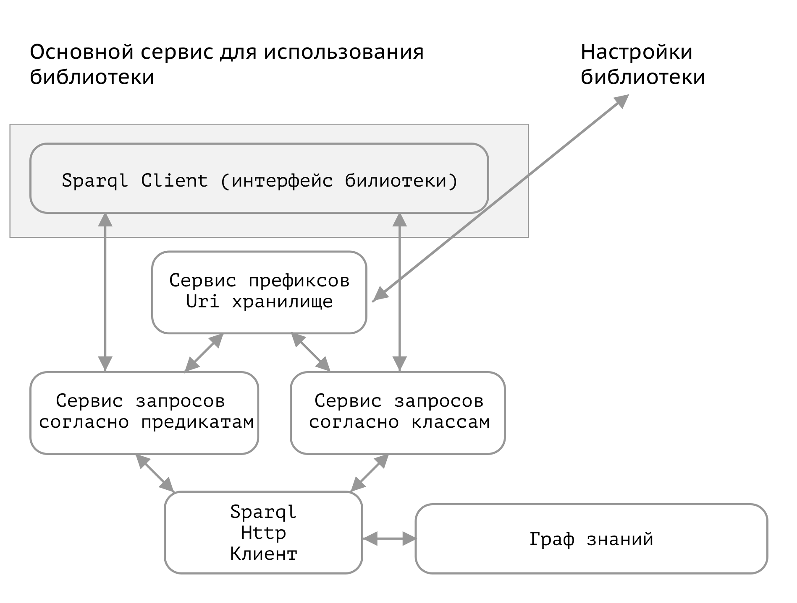

# Sparql client
**Стандартные запросы к связанным данным**

Доступные в библиотеке методы:
- Выбрать любую сущность из сети по классу
- Получить количество сущностей по классу
- Получить сущности в определенном прямоугольнике поиска по координатам
- Получить все триплеты для сущности
- Разворачивает сокращения URI, например dbr:Karlsruhe -> http://dbpedia.org/resource/Karlsruhe/

Схема архитектуры:

